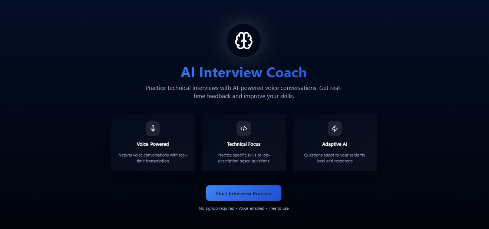
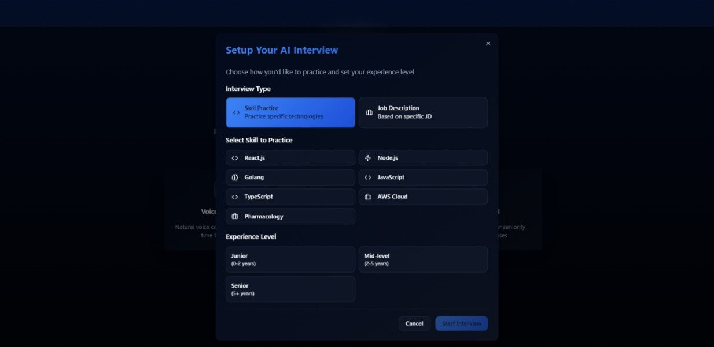
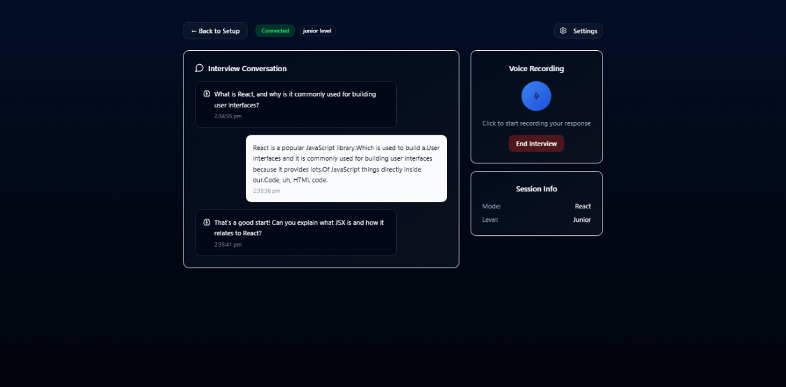

# Aura Interviewer

Aura Interviewer is a full-stack application designed to help you practice technical interviews on demand, powered by real-time voice transcription and adaptive AI questioning. Inspired by the need for accessible, personalized mock interviews, this project combines my skills in TypeScript, React, Node.js, Express, and cloud-based speech recognition.

## Demo





## Features

- **Voice-Powered Interviews:** Speak naturally and get instant transcription.
- **Adaptive AI:** Questions adjust to your seniority level and responses.
- **Skill & JD Modes:** Practice by skill (React, Node.js, AWS, etc.) or paste a job description.
- **Real-Time Feedback:** Get structured, actionable evaluation at the end.
- **No Signup Required:** Free and privacy-friendly.

## Inspiration

I built this project to make mock interviews accessible and effective for anyone preparing for technical roles. The idea came from my own experience wanting instant, realistic practice sessions tailored to my skills and job goals.

## Skills Demonstrated

- **Frontend:** React, TypeScript, Tailwind CSS, Vite
- **Backend:** Node.js, Express, OpenAI API, RESTful design
- **Transcription Engine:** Azure Speech SDK, WebSocket streaming
- **DevOps:** Docker, docker-compose, environment management
- **Testing & Quality:** Modular code, type safety, error handling

## Quick Start (Docker)

1. **Clone the repository:**
   ```sh
   git clone https://github.com/hat-ad/aura-interviewer.git
   cd ai-interviewer
   ```
2. **Start the application:**
   ```sh
   docker-compose up --build
   ```
3. **Access the app:**
   - Frontend: `http://localhost:3000`

## Future Plans

- **Enable AI Speech Responses:** Integrate a feature where the interviewer can respond with synthesized speech, making the interview experience even more interactive and realistic.
- **CV/Resume Integration:** Allow users to upload their CV or resume, enabling the system to generate more personalized and relevant interview questions based on their background.
- **Enhanced Evaluation Quality:** Continuously improve the feedback and evaluation system to provide deeper insights and more actionable recommendations for candidates.

---
